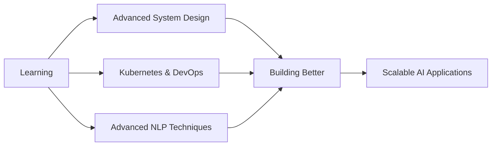

<div align="center">

<!-- Animated Header -->


<!-- Animated Typing Effect -->


<!-- Social Badges with Hover Effect -->
<p>
  <a href="https://www.linkedin.com/in/ridho-aulia-rahman-68a9a6247" target="_blank">
    
  </a>
  <a href="mailto:ridho.aulia133@gmail.com">
    
  </a>
  <a href="https://github.com/EngRidhoNet" target="_blank">
    
  </a>
  <a href="https://ridho-portfolio.dev" target="_blank">
    
  </a>
</p>

<!-- Animated Snake eating contributions -->
<picture>
  <source media="(prefers-color-scheme: dark)" srcset="https://raw.githubusercontent.com/EngRidhoNet/EngRidhoNet/output/github-contribution-grid-snake-dark.svg">
  <source media="(prefers-color-scheme: light)" srcset="https://raw.githubusercontent.com/EngRidhoNet/EngRidhoNet/output/github-contribution-grid-snake.svg">
  
</picture>

</div>

---

## 🚀 About Me


```typescript
const ridho = {
  role: "Full Stack Developer & AI Engineer",
  location: "Jember, East Java 🇮🇩",
  focus: ["Web Development", "AI/ML", "Cloud Architecture"],
  
  currentlyLearning: ["Advanced NLP", "Kubernetes", "System Design"],
  
  workingOn: [
    "Building AI-powered web applications",
    "Contributing to open-source projects",
    "Writing technical blogs"
  ],
  
  lifePhilosophy: "Code is poetry, AI is the future 🚀"
};
```

### 💡 Core Competencies

<table>
  <tr>
    <td align="center" width="33%">
      <br>
      <sub><b>Frontend Development</b></sub><br>
      <sub>Building beautiful, responsive UIs</sub>
    </td>
    <td align="center" width="33%">
      <br>
      <sub><b>Backend Engineering</b></sub><br>
      <sub>Scalable APIs & microservices</sub>
    </td>
    <td align="center" width="33%">
      <br>
      <br>
      <sub><b>AI & Machine Learning</b></sub><br>
      <sub>ML models in production</sub>
    </td>
  </tr>
</table>

---

## 🛠️ Technology Arsenal

<details open>
<summary><b>🎨 Frontend Technologies</b></summary>
<br>


</details>

<details open>
<summary><b>⚙️ Backend & Infrastructure</b></summary>
<br>


</details>

<details open>
<summary><b>🤖 AI & Machine Learning</b></summary>
<br>


</details>

<details open>
<summary><b>☁️ DevOps & Cloud</b></summary>
<br>


</details>

---

## 📊 GitHub Analytics

<div align="center">

<!-- GitHub Stats Cards -->


<!-- GitHub Streak Stats -->


<!-- Activity Graph -->


<!-- Trophy Stats -->


</div>

---

## 🏆 Featured Projects

<div align="center">

<a href="https://github.com/EngRidhoNet/project-1">
  
</a>
<a href="https://github.com/EngRidhoNet/project-2">
  
</a>

</div>

---

## 📝 Latest Blog Posts

<!-- BLOG-POST-LIST:START -->
- 🚀 [Building Scalable APIs with Laravel & Microservices](https://ridho-portfolio.dev/blog/scalable-apis)
- 🤖 [Integrating ML Models into Production Applications](https://ridho-portfolio.dev/blog/ml-production)
- 💡 [Vue.js Performance Optimization Techniques](https://ridho-portfolio.dev/blog/vue-optimization)
- 🔧 [Clean Code Principles Every Developer Should Know](https://ridho-portfolio.dev/blog/clean-code)
<!-- BLOG-POST-LIST:END -->

---

## 🎯 Current Focus



---

## 💼 Professional Services

<div align="center">

| Service | Description | Availability |
|---------|-------------|--------------|
| 🎨 **Web Development** | Full-stack web applications with modern frameworks | ✅ Available |
| 🤖 **AI Integration** | ML model development and deployment | ✅ Available |
| 🏗️ **System Architecture** | Scalable backend design and optimization | ✅ Available |
| 👨‍🏫 **Technical Mentoring** | Code reviews and knowledge sharing | ✅ Available |
| 📊 **Data Analytics** | Business intelligence and predictive modeling | ✅ Available |

</div>

---

## 🤝 Let's Connect!

<div align="center">

### 💬 I'm Available For

**Freelance Projects** • **Technical Consulting** • **Open Source Collaboration** • **Speaking Engagements**

### 📫 Reach Out

<a href="https://www.linkedin.com/in/ridho-aulia-rahman-68a9a6247">
  
</a>
<a href="mailto:ridho.aulia133@gmail.com">
  
</a>
<a href="https://ridho-portfolio.dev">
  
</a>

<!-- Profile Views Counter -->
<br><br>


</div>

---

<div align="center">

### 🌟 "Code is like humor. When you have to explain it, it's bad." – Cory House

<!-- Animated Footer -->


**Made with ❤️ by [Ridho Aulia Rahman](https://github.com/EngRidhoNet)**

</div>
